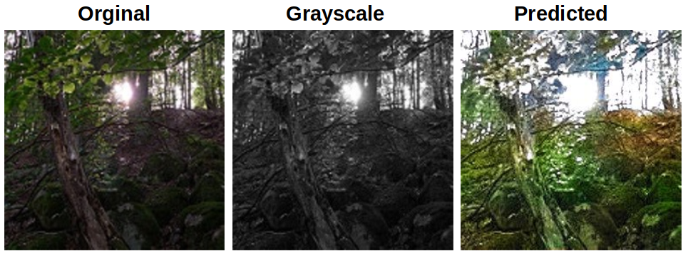

# Grayscale image coloring application


## Requirements


- __python3 3.10.12__ or later
- PIL
- opencv
- torch
- scikit-image
- pytest

__*All the following pip requirements are included in the file “requirements.txt” and can be automatically:*__
```bash
pip install -r requirements.txt
```

Traning dataset: ["Landscape color and grayscale images"](https://www.kaggle.com/datasets/theblackmamba31/landscape-image-colorization).

# Setup
Once the repository is cloned, the program is ready for use.
__Running the GUI module:__
```bash
python3 gica.py
```
__Running the console mode:__
```bash
python3 gica.py -p "Path to grayscale image"
```
The predicted color image will be saved in the location of the processed image

# Run automatic tests
You can use the following command in the program's root directory to run unittest
```bash
python3 -m pytest
```
# Prediction examples
